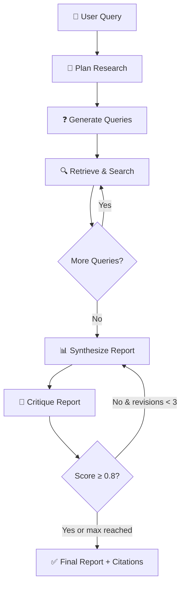

<div align="center">

# 🔮 Arcane

### Agentic Research Intelligence Platform

*A multi-agent AI system that autonomously researches any topic, critiques its own work, and delivers polished, citation-backed reports — in minutes, not hours.*

[](https://python.org)
[](https://fastapi.tiangolo.com)
[](https://redis.io)
[](https://langchain-ai.github.io/langgraph/)
[](https://crewai.com)
[](LICENSE)

---

**[Features](#-features) · [How It Works](#-how-it-works) · [Quick Start](#-quick-start) · [Architecture](#-architecture) · [API Reference](#-api-reference) · [Tech Stack](#-tech-stack)**

</div>

---

## ✨ Features

| | Feature | Description |
|---|---|---|
| 🧭 | **Autonomous Research** | Give it any topic — Arcane decomposes the question, plans a search strategy, retrieves from the web and academic databases, and synthesizes a comprehensive report. |
| 🤖 | **Multi-Agent Collaboration** | Five specialized CrewAI agents — Planner, Query Generator, Researcher, Synthesizer, and Critic — each with unique expertise, working together through LangGraph orchestration. |
| 🔄 | **Self-Improving Critique Loop** | A Critic agent scores every draft against a 5-dimension rubric. Below threshold? It loops back for revision — up to 3 times — until quality passes. |
| ⚡ | **Semantic Caching** | Redis-powered semantic cache with cosine similarity matching. Repeat or similar queries return results ~60× faster. |
| 🔍 | **Hybrid RAG Pipeline** | Vector search (HNSW) + BM25 keyword matching + Cohere reranking for highly relevant document retrieval. |
| 🌐 | **Web UI + Real-time Streaming** | Glassmorphism-styled dark theme UI with WebSocket-driven live progress updates as each agent works. |
| 📡 | **REST API + CLI** | Full FastAPI backend with Swagger docs, plus a clean CLI for terminal workflows. |

---

## 🧠 How It Works

Arcane follows a **Plan → Research → Critique → Synthesize** loop, orchestrated as a stateful graph:



**Example:** Ask *"What are the latest advances in protein folding prediction using AI?"*

1. **Planner** decomposes into sub-questions (AlphaFold3 improvements, competing approaches, limitations, real-world applications)
2. **Query Generator** creates targeted search queries optimized for web and academic databases
3. **Researcher** executes searches via DuckDuckGo + Semantic Scholar + arXiv, reranks results with Cohere, extracts and analyzes content
4. **Synthesizer** weaves findings into a structured report with inline citations
5. **Critic** evaluates against rubrics (credibility, consistency, completeness, citation quality, relevance) — loops until quality threshold is met
6. **Final report** is delivered with formatted citations and metadata

---

## 🖥️ Web UI

<div align="center">

<!-- Replace the path below with your actual screenshot -->
<!--  -->

*Screenshot coming soon — launch with `arcane serve` and open http://localhost:8000*

</div>

---

## 🚀 Quick Start

### Prerequisites

- **Python 3.11+**
- **Docker & Docker Compose** (for Redis)
- **Cohere API key** — [get one free](https://dashboard.cohere.com/api-keys)

### Setup

```bash
# 1. Clone the repository
git clone https://github.com/yourusername/arcane.git
cd arcane

# 2. Create and activate virtual environment
python -m venv .venv
.venv\Scripts\activate       # Windows
# source .venv/bin/activate  # macOS / Linux

# 3. Install dependencies
pip install -e ".[dev]"

# 4. Configure environment
copy .env.example .env       # Windows
# cp .env.example .env       # macOS / Linux
# Then edit .env and add your COHERE_API_KEY

# 5. Start Redis
docker compose up -d

# 6. Verify everything is working
arcane health
```

### Usage

#### CLI
```bash
# Run a research query
arcane research "What are the latest advances in protein folding?"

# Save report to file
arcane research "Quantum error correction methods" -o report.md
```

#### Web UI
```bash
arcane serve
# Open http://localhost:8000 in your browser
```

#### API
```bash
arcane serve
# Swagger docs at http://localhost:8000/docs
```

---

## 🏗 Architecture

Arcane is built on five architectural planes that separate concerns cleanly:

| Plane | Technology | Responsibility |
|---|---|---|
| **Control** | LangGraph | Stateful graph orchestration — conditional routing, checkpointing, error recovery |
| **Execution** | CrewAI | Role-based multi-agent collaboration with structured outputs |
| **Data** | Redis (RedisVL) | Vector search, semantic caching, session state, conversation memory |
| **Retrieval** | DuckDuckGo + Cohere | Web search, academic search, reranking, content extraction |
| **Intelligence** | Cohere API | LLM generation (Command R+), embeddings (Embed v3), reranking (Rerank v3.5) |

### Project Structure

```
arcane/
├── arcane/                     # Core package
│   ├── graph/                  # LangGraph orchestration (state, nodes, edges, builder)
│   ├── agents/                 # CrewAI agents (planner, researcher, critic, synthesizer, query_generator)
│   ├── tools/                  # Search & retrieval tools (DuckDuckGo, Semantic Scholar, arXiv, scraper, reranker)
│   ├── rag/                    # RAG pipeline (embeddings, vector store, hybrid retriever, semantic cache)
│   ├── memory/                 # Redis-backed conversation memory & session state
│   ├── api/                    # FastAPI REST + WebSocket API
│   └── utils/                  # Logging, retry logic, formatting helpers
├── frontend/                   # Web UI (HTML/CSS/JS with glassmorphism dark theme)
├── tests/                      # 46 unit tests across tools, RAG, graph, and agents
├── docker-compose.yml          # Redis Stack
├── pyproject.toml              # Dependencies & project config
└── .env.example                # Environment variable template
```

---

## 📡 API Reference

### REST Endpoints

| Method | Endpoint | Description |
|---|---|---|
| `POST` | `/api/v1/research` | Start a new research session |
| `GET` | `/api/v1/research/{id}` | Get research status & results |
| `POST` | `/api/v1/research/{id}/feedback` | Submit human feedback on a draft |
| `DELETE` | `/api/v1/research/{id}` | Cancel a research session |
| `GET` | `/api/v1/sessions` | List all sessions |
| `GET` | `/api/v1/health` | Health check |

### WebSocket Streaming

```
ws://localhost:8000/ws/research/{session_id}
```

Real-time events stream as each agent works:

```json
{ "type": "status",   "data": { "stage": "planning", "message": "..." } }
{ "type": "progress", "data": { "query": "...", "results_count": 5 } }
{ "type": "draft",    "data": { "content": "...", "revision": 1 } }
{ "type": "critique", "data": { "score": 0.85, "issues": [...] } }
{ "type": "final",    "data": { "report": "...", "citations": [...] } }
```

---

## 🧩 Tech Stack

| Category | Technologies |
|---|---|
| **Orchestration** | [LangGraph](https://langchain-ai.github.io/langgraph/) — stateful graph execution with conditional edges and checkpointing |
| **Agents** | [CrewAI](https://crewai.com) — role-based multi-agent framework with task delegation |
| **LLM** | [Cohere](https://cohere.com) — Command R+ (generation), Embed v3 (embeddings), Rerank v3.5 (reranking) |
| **Search** | [DuckDuckGo](https://duckduckgo.com) (web), [Semantic Scholar](https://semanticscholar.org) + [arXiv](https://arxiv.org) (academic) |
| **Vector Store** | [Redis](https://redis.io) with [RedisVL](https://github.com/redis/redis-vl-python) — HNSW index + hybrid BM25 search |
| **API** | [FastAPI](https://fastapi.tiangolo.com) — REST + WebSocket with Pydantic schemas |
| **Frontend** | Vanilla HTML/CSS/JS — dark glassmorphism theme with ambient animations |
| **Testing** | [pytest](https://pytest.org) — 46 unit tests across all modules |

---

## ⚙️ Configuration

All configuration is managed through environment variables. Copy `.env.example` to `.env` and set:

| Variable | Default | Description |
|---|---|---|
| `COHERE_API_KEY` | *required* | Your Cohere API key |
| `REDIS_URL` | `redis://localhost:6379/0` | Redis connection URL |
| `MAX_SEARCH_RESULTS` | `10` | Results per search query |
| `MAX_REVISIONS` | `3` | Maximum critique-revision cycles |
| `CRITIQUE_THRESHOLD` | `0.8` | Minimum quality score to pass (0.0–1.0) |
| `CACHE_TTL_HOURS` | `24` | Semantic cache expiration |
| `LOG_LEVEL` | `INFO` | Logging verbosity |

---

## 🧪 Testing

```bash
# Run all unit tests
pytest tests/unit/ -v

# With coverage
pytest tests/unit/ -v --cov=arcane

# Integration tests (requires Redis)
docker compose up -d
pytest tests/integration/ -v
```

---

## 📄 License

This project is licensed under the [MIT License](LICENSE).
