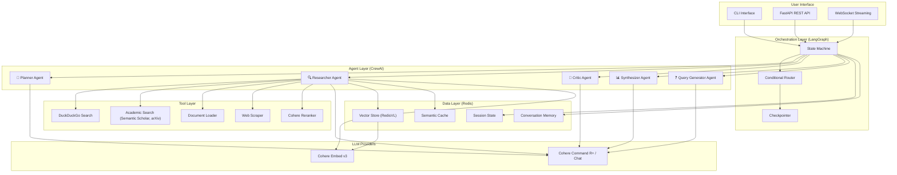
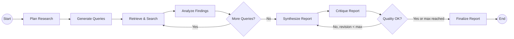

# Arcane — Agentic Research Intelligence Platform

> A multi-agent research system with a RAG pipeline and LangGraph for dynamic search, analysis, and summarisation, optimizing decision-making with graph-based task management.

---

## 1. Vision & Concept

**Arcane** is an AI-powered research agent that autonomously conducts deep research across academic and web sources, synthesises findings into structured reports, and continuously self-improves through critique loops. It is designed for researchers, analysts, and knowledge workers who need to rapidly explore complex topics with verifiable, source-grounded outputs.

### Core Value Propositions

| Capability | Description |
|---|---|
| **Autonomous Research** | Given a research question, Arcane autonomously plans sub-queries, retrieves from multiple sources, and synthesises a comprehensive report |
| **Multi-Agent Collaboration** | Specialized agents (Planner, Researcher, Critic, Synthesizer) collaborate via CrewAI with LangGraph orchestration |
| **Self-Improving Loop** | A Critic agent evaluates outputs against rubrics and triggers refinement cycles until quality thresholds are met |
| **RAG Pipeline** | Retrieval-Augmented Generation with hybrid search (vector + BM25), Cohere reranking, and semantic caching |
| **Graph-Based Orchestration** | LangGraph manages the state machine with conditional branching, loops, and error recovery |
| **Redis-Powered Performance** | Semantic caching, vector storage, session state, and conversation memory via Redis |

---

## 2. High-Level Architecture



### Architectural Planes

| Plane | Technology | Responsibility |
|---|---|---|
| **Control Plane** | LangGraph | State machine, conditional routing, checkpointing, error recovery, human-in-the-loop gates |
| **Execution Plane** | CrewAI | Role-based agents, task delegation, internal collaboration, structured outputs |
| **Data Plane** | Redis (RedisVL) | Vector search, semantic caching, session state, conversation memory |
| **Retrieval Plane** | DuckDuckGo + Cohere | Web search, academic search, reranking, document loading |
| **Intelligence Plane** | Cohere API | LLM generation (Command R+), embeddings (Embed v3), reranking (Rerank v3.5) |

---

## 3. Project Structure

```
arcane/
├── pyproject.toml                  # Project metadata & dependencies
├── .env.example                    # Environment variable template
├── README.md                       # Project documentation
├── docker-compose.yml              # Redis + app containerization
│
├── arcane/                         # Main package
│   ├── __init__.py
│   ├── config.py                   # Configuration management (Pydantic Settings)
│   ├── main.py                     # Application entry point
│   │
│   ├── graph/                      # LangGraph orchestration
│   │   ├── __init__.py
│   │   ├── state.py                # State schema definition
│   │   ├── nodes.py                # Graph node functions
│   │   ├── edges.py                # Conditional edge logic
│   │   ├── builder.py              # Graph construction & compilation
│   │   └── checkpointer.py         # Redis-based checkpointing
│   │
│   ├── agents/                     # CrewAI agent definitions
│   │   ├── __init__.py
│   │   ├── planner.py              # Research Planner agent
│   │   ├── researcher.py           # Deep Researcher agent
│   │   ├── critic.py               # Quality Critic agent
│   │   ├── synthesizer.py          # Report Synthesizer agent
│   │   ├── query_generator.py      # Dynamic Query Generator agent
│   │   └── crew.py                 # Crew assembly & task definitions
│   │
│   ├── tools/                      # LangChain / CrewAI tools
│   │   ├── __init__.py
│   │   ├── web_search.py           # DuckDuckGo web search tool
│   │   ├── academic_search.py      # Academic paper search (Semantic Scholar, arXiv)
│   │   ├── web_scraper.py          # Web page content extraction
│   │   ├── document_loader.py      # PDF / document ingestion
│   │   └── reranker.py             # Cohere reranking tool
│   │
│   ├── rag/                        # RAG pipeline components
│   │   ├── __init__.py
│   │   ├── embeddings.py           # Cohere embedding wrapper
│   │   ├── vectorstore.py          # Redis vector store (RedisVL)
│   │   ├── retriever.py            # Hybrid retriever (vector + BM25)
│   │   ├── cache.py                # Semantic cache implementation
│   │   └── pipeline.py             # End-to-end RAG pipeline
│   │
│   ├── memory/                     # Memory & state management
│   │   ├── __init__.py
│   │   ├── redis_memory.py         # Redis-backed conversation memory
│   │   └── session.py              # Session state management
│   │
│   ├── api/                        # FastAPI REST + WebSocket API
│   │   ├── __init__.py
│   │   ├── app.py                  # FastAPI application factory
│   │   ├── routes/
│   │   │   ├── __init__.py
│   │   │   ├── research.py         # Research endpoints
│   │   │   ├── sessions.py         # Session management endpoints
│   │   │   └── health.py           # Health check endpoints
│   │   ├── schemas.py              # Pydantic request/response models
│   │   └── websocket.py            # WebSocket streaming handler
│   │
│   └── utils/                      # Shared utilities
│       ├── __init__.py
│       ├── logging.py              # Structured logging (structlog)
│       ├── retry.py                # Retry / backoff decorators
│       └── formatting.py           # Output formatting helpers
│
├── tests/                          # Test suite
│   ├── __init__.py
│   ├── conftest.py                 # Shared fixtures
│   ├── unit/
│   │   ├── test_tools.py
│   │   ├── test_rag.py
│   │   ├── test_agents.py
│   │   └── test_graph.py
│   └── integration/
│       ├── test_pipeline.py
│       └── test_api.py
│
└── scripts/                        # Utility scripts
    ├── seed_redis.py               # Seed Redis with sample data
    └── run_research.py             # CLI research runner
```

---

## 4. Detailed Module Design

### 4.1 State Schema (`graph/state.py`)

The LangGraph state is the **single source of truth** passed between all nodes. Every agent reads from and writes to this structured state.

```python
from typing import TypedDict, Annotated, Sequence
from langgraph.graph.message import add_messages

class ResearchState(TypedDict):
    # --- User Input ---
    query: str                              # Original user research question
    session_id: str                         # Unique session identifier
    
    # --- Planning ---
    research_plan: dict                     # Structured plan with sub-questions
    sub_queries: list[str]                  # Generated sub-queries for retrieval
    current_query_index: int                # Track which sub-query we're on
    
    # --- Retrieval ---
    search_results: list[dict]              # Raw search results from tools
    retrieved_documents: list[dict]         # Processed & reranked documents
    source_urls: list[str]                  # Track all sources for citation
    
    # --- Analysis ---
    intermediate_findings: list[dict]       # Per-query analysis results
    
    # --- Critique Loop ---
    draft_report: str                       # Current draft of the report
    critique: dict                          # Critic's structured feedback
    critique_score: float                   # 0.0-1.0 quality score
    revision_count: int                     # Number of revisions performed
    max_revisions: int                      # Maximum allowed revisions
    
    # --- Final Output ---
    final_report: str                       # Approved final report
    citations: list[dict]                   # Structured citation list
    
    # --- Metadata ---
    messages: Annotated[list, add_messages] # Conversation history
    errors: list[str]                       # Error log
    status: str                             # Current pipeline status
```

### 4.2 LangGraph Workflow (`graph/builder.py`)

The core orchestration graph implements the **Plan → Research → Critique → Synthesize** lifecycle with conditional loops.



**Key Design Decisions:**
- **Conditional Edges**: The `MORE` and `PASS` decision nodes use LangGraph conditional edges to dynamically route the workflow
- **Bounded Loops**: The critique loop has a `max_revisions` ceiling (default: 3) to prevent infinite loops
- **Checkpointing**: Every node transition is checkpointed to Redis for crash recovery
- **Error Recovery**: Failed tool calls trigger retry logic before escalating to an error state

### 4.3 Agent Definitions

#### 🧭 Planner Agent (`agents/planner.py`)

| Property | Value |
|---|---|
| **Role** | Senior Research Strategist |
| **Goal** | Decompose a complex research question into a structured plan with prioritized sub-questions |
| **Backstory** | A veteran academic researcher with 20 years of experience in systematic literature reviews. Expert at identifying research gaps and formulating precise, searchable questions. |
| **Tools** | None (pure reasoning) |
| **Output** | Structured JSON: `{ "main_thesis": str, "sub_questions": list[str], "search_strategy": str, "expected_sources": list[str] }` |

#### 🔍 Researcher Agent (`agents/researcher.py`)

| Property | Value |
|---|---|
| **Role** | Deep Research Specialist |
| **Goal** | Execute search queries across multiple sources and extract relevant information with source attribution |
| **Backstory** | An information retrieval expert skilled at mining both academic databases and the open web. Known for finding obscure but highly relevant sources. |
| **Tools** | `DuckDuckGoSearch`, `AcademicSearch`, `WebScraper`, `DocumentLoader`, `CohereReranker` |
| **Output** | Structured JSON: `{ "findings": list[dict], "sources": list[dict], "confidence": float }` |

#### 📝 Critic Agent (`agents/critic.py`)

| Property | Value |
|---|---|
| **Role** | Research Quality Auditor |
| **Goal** | Evaluate research outputs against strict academic rubrics and provide actionable improvement feedback |
| **Backstory** | A peer-review expert who has reviewed thousands of research papers. Relentless about source credibility, logical consistency, and completeness. Never accepts mediocre work. |
| **Tools** | None (pure evaluation) |
| **Output** | Structured JSON: `{ "score": float, "passed": bool, "issues": list[dict], "suggestions": list[str] }` |
| **Rubric** | Source credibility (0-10), Logical consistency (0-10), Completeness (0-10), Citation quality (0-10), Relevance to query (0-10) |

#### 📊 Synthesizer Agent (`agents/synthesizer.py`)

| Property | Value |
|---|---|
| **Role** | Research Synthesis Expert |
| **Goal** | Weave multiple research findings into a coherent, well-structured report with proper citations |
| **Backstory** | A science communicator who excels at synthesizing complex research into accessible, comprehensive reports. Masterful at identifying themes across disparate sources. |
| **Tools** | None (pure synthesis) |
| **Output** | Markdown report with inline citations, section headings, key findings, and recommendations |

#### ❓ Query Generator Agent (`agents/query_generator.py`)

| Property | Value |
|---|---|
| **Role** | Search Query Optimization Specialist |
| **Goal** | Transform abstract research questions into precise, tool-optimized search queries |
| **Backstory** | An information science expert who understands both academic database query syntax and web search optimization. Expert at query expansion and reformulation. |
| **Tools** | None (pure query generation) |
| **Output** | Structured JSON: `{ "queries": list[{"query": str, "target": "web"|"academic", "intent": str}] }` |

### 4.4 Tool Implementations

#### Web Search Tool (`tools/web_search.py`)
```python
# Uses langchain_community.tools.DuckDuckGoSearchResults
# - Returns structured results with title, snippet, URL
# - Configurable max_results (default: 10)
# - Region and time-range filtering
# - Rate limiting to avoid throttling
```

#### Academic Search Tool (`tools/academic_search.py`)
```python
# Custom tool wrapping Semantic Scholar API + arXiv API
# - Search by keyword, author, DOI
# - Return structured paper metadata (title, abstract, authors, year, citations)
# - Filter by year range, citation count, venue
# - Pagination support for deep dives
```

#### Cohere Reranker Tool (`tools/reranker.py`)
```python
# Wraps Cohere Rerank v3.5 API
# - Takes query + candidate documents
# - Returns reranked results with relevance scores
# - Configurable top_k (default: 5)
# - Supports both text and document object inputs
```

#### Web Scraper Tool (`tools/web_scraper.py`)
```python
# Extracts clean text content from URLs
# - Uses httpx + BeautifulSoup / trafilatura
# - Handles JavaScript-rendered pages via fallback
# - Returns structured content with metadata
# - Respects robots.txt and rate limits
```

### 4.5 RAG Pipeline (`rag/`)

#### Embedding Strategy
- **Model**: Cohere `embed-english-v3.0` (1024 dimensions)
- **Input Types**: `search_document` for indexing, `search_query` for retrieval
- **Batch Processing**: Embed in batches of 96 for efficiency

#### Vector Store (Redis)
- **Engine**: RedisVL with HNSW index
- **Schema**: Document text, embedding vector, metadata (source, timestamp, query)
- **Hybrid Search**: Combines vector similarity (cosine) with BM25 keyword matching
- **Index Management**: Automatic index creation, TTL-based cleanup

#### Semantic Cache
- **Strategy**: Before each LLM call, check Redis for semantically similar past queries
- **Threshold**: Cosine similarity > 0.92 triggers cache hit
- **TTL**: Cached responses expire after 24 hours
- **Benefit**: ~60x faster responses on cache hits, significant cost reduction

#### Retrieval Pipeline
```
User Query
    → Semantic Cache Check (Redis)
        → Cache Hit → Return cached response
        → Cache Miss
            → Query Rewriting (LLM)
            → Hybrid Search (Redis Vector + BM25)
            → Cohere Reranking (top-k filtering)
            → Context Assembly
            → LLM Generation
            → Cache Store (Redis)
            → Return response
```

### 4.6 API Design (`api/`)

#### REST Endpoints

| Method | Endpoint | Description |
|---|---|---|
| `POST` | `/api/v1/research` | Start a new research session |
| `GET` | `/api/v1/research/{session_id}` | Get research status & results |
| `POST` | `/api/v1/research/{session_id}/feedback` | Submit human feedback on a draft |
| `DELETE` | `/api/v1/research/{session_id}` | Cancel a research session |
| `GET` | `/api/v1/sessions` | List all sessions |
| `GET` | `/api/v1/health` | Health check |

#### WebSocket Streaming
```
ws://localhost:8000/ws/research/{session_id}

Events:
  → { "type": "status", "data": { "stage": "planning", "message": "..." } }
  → { "type": "progress", "data": { "query": "...", "results_count": 5 } }
  → { "type": "draft", "data": { "content": "...", "revision": 1 } }
  → { "type": "critique", "data": { "score": 0.7, "issues": [...] } }
  → { "type": "final", "data": { "report": "...", "citations": [...] } }
  → { "type": "error", "data": { "message": "..." } }
```

---

## 5. Key Workflow: End-to-End Research Session

Here's what happens when a user submits: *"What are the latest advances in protein folding prediction using AI?"*

### Step 1: Planning
```
User Query → Planner Agent
Output: {
  "main_thesis": "AI-driven protein structure prediction methods and their impact",
  "sub_questions": [
    "What is AlphaFold3 and how does it improve on AlphaFold2?",
    "What competing approaches exist (RoseTTAFold, ESMFold)?",
    "What are the current limitations of AI protein folding?",
    "What real-world applications have emerged from these advances?"
  ],
  "search_strategy": "academic_first_then_web",
  "expected_sources": ["Nature", "Science", "arXiv", "PDB", "DeepMind blog"]
}
```

### Step 2: Query Generation
```
Sub-questions → Query Generator Agent
Output: {
  "queries": [
    { "query": "AlphaFold3 architecture improvements 2024 2025", "target": "academic", "intent": "technical_details" },
    { "query": "AlphaFold3 vs AlphaFold2 accuracy benchmarks", "target": "web", "intent": "comparison" },
    { "query": "RoseTTAFold ESMFold protein structure prediction", "target": "academic", "intent": "alternatives" },
    { "query": "AI protein folding limitations challenges", "target": "web", "intent": "critical_analysis" },
    { "query": "protein structure prediction drug discovery applications", "target": "academic", "intent": "applications" }
  ]
}
```

### Step 3: Retrieval Loop (per query)
```
For each query:
  1. Check semantic cache → miss
  2. Execute DuckDuckGo / Academic search → 10-20 raw results
  3. Cohere Rerank (query, results) → top 5 most relevant
  4. Extract & chunk content from top URLs
  5. Store embeddings in Redis vector store
  6. Analyze findings with Researcher Agent
  7. Append to intermediate_findings
```

### Step 4: Synthesis
```
All intermediate_findings → Synthesizer Agent
Output: Draft report (2000-4000 words) with:
  - Executive summary
  - Detailed findings per sub-question
  - Cross-cutting themes
  - Inline citations [1], [2], ...
  - Recommendations for further research
```

### Step 5: Critique Loop
```
Draft → Critic Agent → Evaluation:
{
  "score": 0.72,
  "passed": false,
  "issues": [
    { "category": "completeness", "severity": "high", "detail": "Missing discussion of ESMFold limitations" },
    { "category": "citation", "severity": "medium", "detail": "Claim about accuracy improvement lacks specific citation" }
  ],
  "suggestions": [
    "Add a paragraph comparing ESMFold and AlphaFold3 limitations",
    "Include the CASP15 benchmark results with specific accuracy numbers"
  ]
}

→ Score < 0.8 and revision_count < 3
→ Route back to Synthesizer with critique feedback
→ Revised draft → Critic → Score: 0.85 → Passed ✓
```

### Step 6: Finalization
```
Approved report → Format citations → Generate metadata → Store in Redis → Return to user
```

---

## 6. Dependencies

```toml
[project]
name = "arcane"
version = "0.1.0"
requires-python = ">=3.11"

dependencies = [
    # Orchestration & Agents
    "langgraph>=0.2.0",
    "langchain>=0.3.0",
    "langchain-community>=0.3.0",
    "langchain-cohere>=0.3.0",
    "crewai>=0.80.0",
    
    # LLM & Embeddings
    "cohere>=5.0.0",
    
    # Search & Retrieval
    "duckduckgo-search>=6.0.0",
    
    # Vector Store & Cache
    "redis>=5.0.0",
    "redisvl>=0.3.0",
    
    # Web & API
    "fastapi>=0.115.0",
    "uvicorn[standard]>=0.30.0",
    "httpx>=0.27.0",
    "websockets>=13.0",
    
    # Content Extraction
    "beautifulsoup4>=4.12.0",
    "trafilatura>=1.12.0",
    
    # Configuration & Utilities
    "pydantic>=2.9.0",
    "pydantic-settings>=2.5.0",
    "python-dotenv>=1.0.0",
    "structlog>=24.0.0",
    "tenacity>=9.0.0",
    
    # Document Processing
    "pypdf>=4.0.0",
]

[project.optional-dependencies]
dev = [
    "pytest>=8.0.0",
    "pytest-asyncio>=0.24.0",
    "pytest-cov>=5.0.0",
    "ruff>=0.6.0",
    "mypy>=1.11.0",
]
```

---

## 7. Verification Plan

### Automated Tests
```bash
# Unit tests for all modules
pytest tests/unit/ -v --cov=arcane

# Integration tests (requires Redis running)
docker compose up -d redis
pytest tests/integration/ -v

# Type checking
mypy arcane/

# Linting
ruff check arcane/
```

### Manual Verification
1. **CLI Smoke Test**: Run a research query end-to-end via CLI and verify report quality
2. **API Test**: Start the FastAPI server and test all endpoints via browser/curl
3. **WebSocket Test**: Connect to the WebSocket and verify real-time streaming of research progress
4. **Cache Verification**: Run the same query twice and verify the second response uses the semantic cache
5. **Critique Loop**: Intentionally trigger a low-quality draft and verify the critique loop improves it

---


