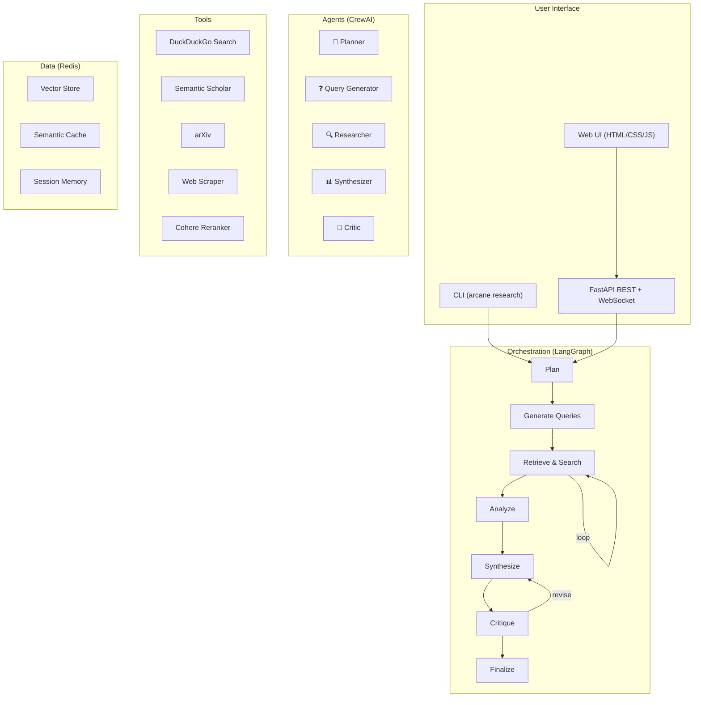

# Arcane — Build Walkthrough

## Overview

Arcane is a **multi-agent research intelligence platform** that autonomously conducts deep research across academic and web sources, synthesizes findings into structured reports, and self-improves through critique loops.

Built with **LangGraph** (orchestration), **CrewAI** (agent collaboration), **Redis** (vector store + cache), **Cohere** (LLM + embeddings + reranking), and **DuckDuckGo** (free web search).

---

## Architecture Summary



---

## What Was Built

### Phase 1: Foundation
| File | Purpose |
|---|---|
| [pyproject.toml](file:///c:/Users/ASUS/Desktop/arcane/pyproject.toml) | Project metadata, all dependencies, tool config |
| [.env.example](file:///c:/Users/ASUS/Desktop/arcane/.env.example) | Environment variable template |
| [docker-compose.yml](file:///c:/Users/ASUS/Desktop/arcane/docker-compose.yml) | Redis Stack with RediSearch + RedisInsight |
| [config.py](file:///c:/Users/ASUS/Desktop/arcane/arcane/config.py) | Pydantic Settings with .env loading |
| [utils/logging.py](file:///c:/Users/ASUS/Desktop/arcane/arcane/utils/logging.py) | structlog with dev console + production JSON modes |
| [utils/retry.py](file:///c:/Users/ASUS/Desktop/arcane/arcane/utils/retry.py) | Tenacity retry decorator for API resilience |
| [utils/formatting.py](file:///c:/Users/ASUS/Desktop/arcane/arcane/utils/formatting.py) | Citation formatting, report metadata, text utilities |
| [main.py](file:///c:/Users/ASUS/Desktop/arcane/arcane/main.py) | CLI entry point: `research`, `serve`, `health` commands |

---

### Phase 2: Tools & RAG
| File | Purpose |
|---|---|
| [tools/web_search.py](file:///c:/Users/ASUS/Desktop/arcane/arcane/tools/web_search.py) | DuckDuckGo web + news search with structured output |
| [tools/academic_search.py](file:///c:/Users/ASUS/Desktop/arcane/arcane/tools/academic_search.py) | Semantic Scholar + arXiv API integration |
| [tools/web_scraper.py](file:///c:/Users/ASUS/Desktop/arcane/arcane/tools/web_scraper.py) | trafilatura + BeautifulSoup content extraction |
| [tools/document_loader.py](file:///c:/Users/ASUS/Desktop/arcane/arcane/tools/document_loader.py) | PDF ingestion with sentence-aware chunking |
| [tools/reranker.py](file:///c:/Users/ASUS/Desktop/arcane/arcane/tools/reranker.py) | Cohere Rerank v3.5 relevance scoring |
| [rag/embeddings.py](file:///c:/Users/ASUS/Desktop/arcane/arcane/rag/embeddings.py) | Cohere Embed v3 wrapper with batch + input types |
| [rag/vectorstore.py](file:///c:/Users/ASUS/Desktop/arcane/arcane/rag/vectorstore.py) | Redis vector store with HNSW + hybrid search |
| [rag/retriever.py](file:///c:/Users/ASUS/Desktop/arcane/arcane/rag/retriever.py) | Hybrid retriever (vector + BM25 + Cohere reranking) |
| [rag/cache.py](file:///c:/Users/ASUS/Desktop/arcane/arcane/rag/cache.py) | Semantic cache with cosine similarity threshold |
| [rag/pipeline.py](file:///c:/Users/ASUS/Desktop/arcane/arcane/rag/pipeline.py) | End-to-end RAG: cache → retrieve → rerank → generate |

---

### Phase 3: CrewAI Agents
| File | Purpose |
|---|---|
| [agents/planner.py](file:///c:/Users/ASUS/Desktop/arcane/arcane/agents/planner.py) | Research decomposition into sub-questions |
| [agents/query_generator.py](file:///c:/Users/ASUS/Desktop/arcane/arcane/agents/query_generator.py) | Optimized search query generation |
| [agents/researcher.py](file:///c:/Users/ASUS/Desktop/arcane/arcane/agents/researcher.py) | Deep research with 6 CrewAI-native tool wrappers |
| [agents/synthesizer.py](file:///c:/Users/ASUS/Desktop/arcane/arcane/agents/synthesizer.py) | Report synthesis with citations |
| [agents/critic.py](file:///c:/Users/ASUS/Desktop/arcane/arcane/agents/critic.py) | 5-dimension quality auditing rubric |
| [agents/crew.py](file:///c:/Users/ASUS/Desktop/arcane/arcane/agents/crew.py) | Task factories + crew assembly for each phase |

---

### Phase 4: LangGraph Orchestration
| File | Purpose |
|---|---|
| [graph/state.py](file:///c:/Users/ASUS/Desktop/arcane/arcane/graph/state.py) | ResearchState TypedDict — single source of truth |
| [graph/nodes.py](file:///c:/Users/ASUS/Desktop/arcane/arcane/graph/nodes.py) | 7 node functions + JSON extraction helper |
| [graph/edges.py](file:///c:/Users/ASUS/Desktop/arcane/arcane/graph/edges.py) | Conditional routing: retrieval loop + critique decision |
| [graph/builder.py](file:///c:/Users/ASUS/Desktop/arcane/arcane/graph/builder.py) | StateGraph construction and compilation |
| [graph/checkpointer.py](file:///c:/Users/ASUS/Desktop/arcane/arcane/graph/checkpointer.py) | Redis checkpointer + MemorySaver fallback |

---

### Phase 5: FastAPI + Memory
| File | Purpose |
|---|---|
| [api/app.py](file:///c:/Users/ASUS/Desktop/arcane/arcane/api/app.py) | App factory with CORS, lifespan, static file serving |
| [api/schemas.py](file:///c:/Users/ASUS/Desktop/arcane/arcane/api/schemas.py) | Pydantic request/response models |
| [api/routes/research.py](file:///c:/Users/ASUS/Desktop/arcane/arcane/api/routes/research.py) | Research CRUD + background pipeline execution |
| [api/routes/sessions.py](file:///c:/Users/ASUS/Desktop/arcane/arcane/api/routes/sessions.py) | Session listing and management |
| [api/routes/health.py](file:///c:/Users/ASUS/Desktop/arcane/arcane/api/routes/health.py) | Health check with Redis probe |
| [api/websocket.py](file:///c:/Users/ASUS/Desktop/arcane/arcane/api/websocket.py) | Real-time streaming of research progress |
| [memory/redis_memory.py](file:///c:/Users/ASUS/Desktop/arcane/arcane/memory/redis_memory.py) | Conversation memory with window + TTL |
| [memory/session.py](file:///c:/Users/ASUS/Desktop/arcane/arcane/memory/session.py) | Session state CRUD in Redis |

---

### Phase 6: Web UI
| File | Purpose |
|---|---|
| [frontend/index.html](file:///c:/Users/ASUS/Desktop/arcane/frontend/index.html) | Full app shell: sidebar, hero, pipeline tracker, report view |
| [frontend/styles.css](file:///c:/Users/ASUS/Desktop/arcane/frontend/styles.css) | Dark theme with glassmorphism, ambient orbs, animations |
| [frontend/app.js](file:///c:/Users/ASUS/Desktop/arcane/frontend/app.js) | API calls, WebSocket streaming, markdown rendering |

---

### Phase 7: Tests
| File | Tests |
|---|---|
| [test_tools.py](file:///c:/Users/ASUS/Desktop/arcane/tests/unit/test_tools.py) | 14 tests — tool metadata, chunking, error handling |
| [test_rag.py](file:///c:/Users/ASUS/Desktop/arcane/tests/unit/test_rag.py) | 7 tests — embedding, document model, imports |
| [test_graph.py](file:///c:/Users/ASUS/Desktop/arcane/tests/unit/test_graph.py) | 11 tests — state schema, edges, graph builder, JSON extraction |
| [test_agents.py](file:///c:/Users/ASUS/Desktop/arcane/tests/unit/test_agents.py) | 14 tests — agent creation, tasks, crew assembly |

---

## Validation Results

```
====================== 46 passed, 14 warnings in 12.37s =======================
```

All 46 unit tests pass ✅

---

## How to Run

### 1. Prerequisites
```bash
# Python 3.11+, Docker
```

### 2. Setup
```bash
cd arcane
copy .env.example .env
# Edit .env → add your COHERE_API_KEY

# Install
.venv\Scripts\activate
pip install -e ".[dev]"

# Start Redis
docker compose up -d
```

### 3. CLI Usage
```bash
# Check health
arcane health

# Run a research query
arcane research "What are the latest advances in protein folding?"

# Save report to file
arcane research "Quantum error correction" -o report.md
```

### 4. API Server + Web UI
```bash
arcane serve
# Open http://localhost:8000 for the Web UI
# API docs at http://localhost:8000/docs
```

### 5. API Endpoints
| Method | Endpoint | Description |
|---|---|---|
| `POST` | `/api/v1/research` | Start new research |
| `GET` | `/api/v1/research/{id}` | Get results |
| `POST` | `/api/v1/research/{id}/feedback` | Submit feedback |
| `DELETE` | `/api/v1/research/{id}` | Cancel |
| `GET` | `/api/v1/sessions` | List sessions |
| `GET` | `/api/v1/health` | Health check |
| `WS` | `/ws/research/{id}` | Real-time streaming |

---

## Key Design Decisions

1. **CrewAI tool wrappers**: CrewAI's `BaseTool` is different from LangChain's. The researcher agent uses thin CrewAI-native wrappers that delegate to the LangChain tool implementations.

2. **Autonomous + optional HITL**: The critique loop runs autonomously by default (max 3 revisions). Users can enable "Review Mode" in the UI to get approval gates between revisions.

3. **Bounded critique loops**: `max_revisions` ceiling prevents infinite loops. If quality never passes, the best-effort report is finalized.

4. **Semantic caching**: Before any LLM call, the cache checks for semantically similar past queries (cosine similarity > 0.92). This provides ~60x speedup on cache hits.

5. **Fallback resilience**: Every node has try/except with fallback logic. If the Planner fails, the raw query is used. If reranking fails, original order is preserved.
